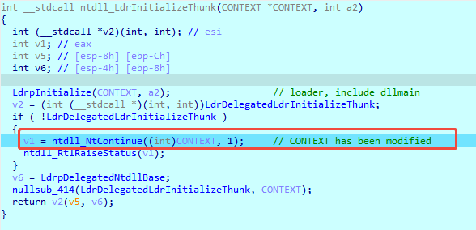
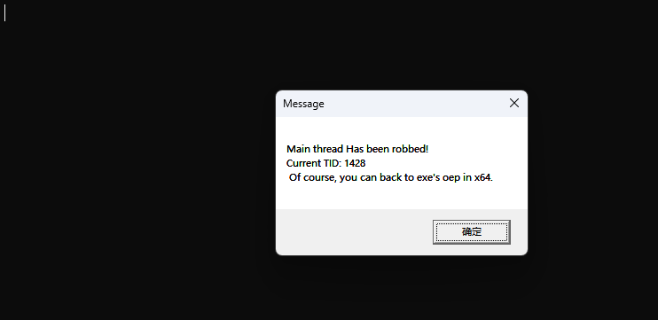
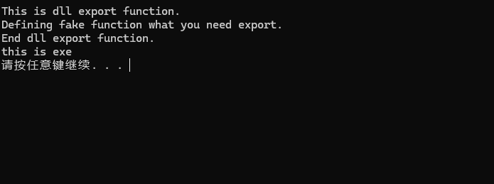

# Native_Thread_Robber

Using DLL sideloading to hijack the exe main thread before starting it!  
YES! NTR main thread, rob CPU dominance.  
使用dll侧载在exe程序主线程启动之前劫持主线程。  

## Theory
There has Windows Loader Before main thread resume.  
在主线程启动前有一个windows加载器。  
Windows Loader will initialize everything needed for exe running.  
加载器会初始化exe运行时需要的所有东西。  
Dllmain will running in this state, then RtlUserThreadStart will resume exe main thread who is called by NtContinue.  
Dllmain会在该阶段运行，然后NtContinue调用RtlUserThreadStart拉起exe主线程。  
We can modify NtContinue parameter-CONTEXT to hijack main thread. The CONTEXT stored on the stack.  
我们可以通过修改NtContinue的参数CONTEXT来劫持主线程。 CONTEXT结构体被储存在栈中。  

Call chain:  
LdrInitializeThunk->LdrpInitialize->dllmain->NtContinue->RtlUserThreadStart->EXE Oep  
Modify call chain:  
LdrInitializeThunk->LdrpInitialize->dllmain->NtContinue->shellcode  

old:
If you want resume exe main thread in x64(x86 has wow64, so I did not continue to dig deeper):   
shellcode->RtlUserThreadStart->EXE Oep

new:
Now, you can resume exe in both x86 and x64.
detail [NTR_loader](https://github.com/miunasu/NTR_loader).

## Example
In x64:  
NTR the main thread.  

  

Back to main thread:  

## Support
It's support x64 and x86 both.  
If you have any question, please open an issue on GitHub.

